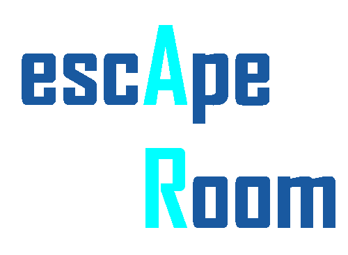

-----

**Durham University Software Engineering (COMP2281 | 2021/22) - Group 16's Project for IBM: AR escape room.**
  
This repository contains the Unity Project files for our product, alongside several sample builds.

Due to the significant size of the project files we have been unable to upload the project to this GitHub repository. Please see the Google Drive link to download the latest version of the Unity project (+ sample builds):

https://drive.google.com/drive/folders/1jbKmINN9xfHHAV5aZEHACywLo3FLQT1E?usp=sharing
  
### Project Files Folder Contents:

1. Assets (Folder - Contains scripts, models, scenes, plugins, and other custom project assets).
2. iOS Build (Folder - Contains latest iOS Xcode project build).
3. Library (Folder - Unity Library folder containing project data, does not need to be downloaded).
4. Logs (Folder - Unity Logs folder containing recent logs, does not need to be downloaded).
5. Packages (Folder - Contains the Unity manifest for the packages required for the project. Must be downloaded).
6. Project Settings (Folder - Contains the Unity project settings. Must be downloaded).
7. Temp (Folder - Temp folder used by Unity, does not need to be downloaded).
8. UserSettings (Folder - Software settings we used when developing the project, does not need to be downloaded).
9. android-ui-build.apk (APK File - Latest Android build of the scene containing all the UI for the project).
